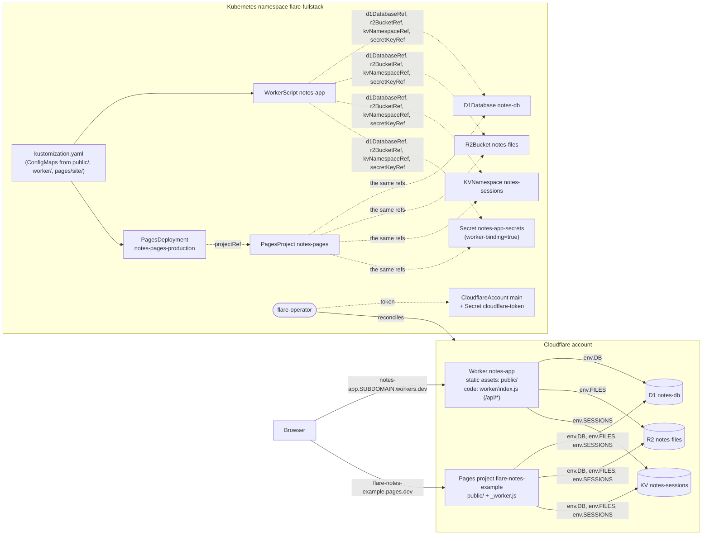

# Full-stack example: a notes app deployed only with flare-operator objects

A small but complete app: a single-page frontend, a JSON API, a SQL database, file storage,
sessions and a secret, all declared as Kubernetes objects and deployed with one command:

```sh
kubectl apply -k examples/fullstack
```

Users write notes (title and text), optionally attach a file, open a note by its URL
(`/notes/42`) and delete it. Notes belong to an anonymous browser session held in a signed
cookie.

> **Verified against flarefake only.** Everything here was tested against the operator's
> emulator (`internal/fake`), not the live Cloudflare API. See [What was tested](#what-was-tested).

## Architecture



### One Worker for frontend and backend

The app is one `WorkerScript` (`worker.yaml`). That is the layout Cloudflare recommends for a
new full-stack app on Workers: the frontend is the Worker's **static assets** and the backend is
the same Worker's code.

- Cloudflare serves the files of `public/` itself. Requests for them never run the Worker's
  code and are not billed as Worker invocations.
- `run_worker_first_paths: ["/api/*"]` sends only the API's requests to the code
  (`worker/index.js`).
- `not_found_handling: single-page-application` answers any other unknown path with
  `index.html`, so the frontend's own routes work as deep links.
- Frontend and API share one origin, so there is no CORS setup, and the session cookie is
  first-party.

The alternative is a second, API-only `WorkerScript` that the frontend Worker calls through a
`service` binding (`serviceRef`). That is worth it when the API is shared by several frontends
or deployed on its own schedule. For one app it adds a second script, a hop and a binding for
nothing, so this example keeps one.

### The Pages variant

`pages/` deploys the same app as a Cloudflare Pages project instead:

- `PagesProject notes-pages` binds the same D1 database, R2 bucket, KV namespace and secret,
  under the same names.
- `PagesDeployment notes-pages-production` uploads `public/` with `worker/index.js` as
  `_worker.js` (Pages' advanced mode) and a `_routes.json` that sends only `/api/*` to it.

The same code runs unchanged in both variants.

For new projects, Cloudflare recommends Workers static assets over Pages. The variant is here
for teams that already run on Pages, and to show the Pages kinds. Both variants deploy by
default and share the data. To deploy only the Worker, remove `pages/project.yaml`,
`pages/deployment.yaml` and the `notes-pages-site` generator from `kustomization.yaml`.

## Files

| File | What it is |
|---|---|
| `kustomization.yaml` | The namespace, the resources, and three generated ConfigMaps (the Worker's assets, its module, and the Pages site). They are labelled `cloudflare.flare.dev/artifact=true` and have no hash suffix. |
| `namespace.yaml` | Namespace `flare-fullstack` |
| `account.yaml` | The token `Secret` and `CloudflareAccount main` (**placeholders**) |
| `secrets.yaml` | The `Secret` for the `secret_text` binding `SESSION_SECRET`, labelled `cloudflare.flare.dev/worker-binding=true` (**placeholder**) |
| `data.yaml` | `D1Database notes-db`, `R2Bucket notes-files` and `KVNamespace notes-sessions` |
| `worker.yaml` | `WorkerScript notes-app`: modules and assets from the ConfigMaps, and bindings for D1, R2, KV, the secret and the assets. workers.dev is on. |
| `pages/project.yaml`, `pages/deployment.yaml` | The Pages variant |
| `public/` | The frontend: `index.html`, `app.js`, `style.css` |
| `worker/index.js` | The API (ES module) |
| `pages/site/_routes.json` | The Pages routing file: only `/api/*` invokes `_worker.js` |
| `schema.sql` | The D1 schema (applied by you, see below) |

## Token permissions

Create an API token, preferably an account-owned one, with these permissions. The names are the dashboard's Account › product › level. The main
[README](../../README.md#token-permissions) maps them to the spec's permission groups.

| For | Permission |
|---|---|
| `WorkerScript` (script, assets, workers.dev route) | Workers Scripts › Edit |
| `KVNamespace` | Workers KV Storage › Edit |
| `D1Database` | D1 › Edit |
| `R2Bucket` | Workers R2 Storage › Edit |
| `PagesProject`, `PagesDeployment` | Cloudflare Pages › Edit |
| Ownership tags (on by default; `ownershipTags=false` in the chart turns them off) | Tag (UNVERIFIED: the spec names no group) |

Before you deploy:

- **R2** must be enabled on the account, in the dashboard. This may require a payment method.
- The account needs a **workers.dev subdomain**. If it has none, choose one in the dashboard
  (Workers & Pages). Without it, `status.atProvider.url` stays empty.

`wrangler d1 execute` (below) needs D1 › Edit too. It can use the same token, or `wrangler login`.

## Deploy

1. Install the operator (main [README](../../README.md)).
2. Fill in the placeholders. Better still, create the two Secrets with `kubectl create secret`
   (the commands are in `account.yaml` and `secrets.yaml`) and remove the files from
   `kustomization.yaml`, so no token or secret lands in Git.
   - `account.yaml`: `spec.accountID` and the token.
   - `secrets.yaml`: `session-secret`, a long random string (`openssl rand -base64 32`).
   - `pages/project.yaml`: `forProvider.name`. It becomes `<name>.pages.dev`, which must be
     free across all of Pages.
3. Apply:

   ```sh
   kubectl apply -k examples/fullstack
   ```

   Everything is created at once. The WorkerScript and PagesProject report `Synced=False`,
   reason `DependencyNotReady`, until the D1 database, R2 bucket and KV namespace are Ready.
   Then they bind those objects' Cloudflare IDs and upload.

### Apply the D1 schema

The operator manages the database as a resource. It creates, observes and deletes it, but never
runs SQL in it. Schema migrations are application-level: when and how to change a live schema,
and how to back it out, is up to the app. So apply `schema.sql` yourself, once, and every later
migration:

```sh
export CLOUDFLARE_ACCOUNT_ID=<your account ID>
export CLOUDFLARE_API_TOKEN=<a token with D1 › Edit>
npx wrangler d1 execute notes-db --remote --file examples/fullstack/schema.sql
```

`notes-db` is the Cloudflare name from `data.yaml`. The file is idempotent
(`CREATE ... IF NOT EXISTS`). For versioned migrations (`wrangler d1 migrations apply`), wrangler
needs a config file with a `d1_databases` entry. Its `database_id` is the object's status:

```sh
kubectl -n flare-fullstack get d1database notes-db -o jsonpath='{.status.id}'
```

Until the schema is applied, `/api/notes` answers 500: the table does not exist.

## Verify

```sh
kubectl -n flare-fullstack get cloudflare        # every managed kind: READY and SYNCED True
kubectl -n flare-fullstack get cloudflareaccount main
```

The URLs are in the status:

```sh
# The Worker (frontend and API): https://notes-app.<your subdomain>.workers.dev
kubectl -n flare-fullstack get workerscript notes-app -o jsonpath='{.status.atProvider.url}{"\n"}'
# The Pages project: https://<name>.pages.dev
kubectl -n flare-fullstack get pagesproject notes-pages -o jsonpath='{.status.atProvider.url}{"\n"}'
# The deployment's own URL
kubectl -n flare-fullstack get pagesdeployment notes-pages-production -o jsonpath='{.status.atProvider.url}{"\n"}'
```

Other useful status fields:

| Object | Field | Meaning |
|---|---|---|
| every managed object | `status.id` | The Cloudflare ID: D1 database UUID, bucket name, KV namespace ID, script name, project name, deployment ID |
| `WorkerScript` | `status.atProvider.bindings` | The bindings as Cloudflare reports them (names and types) |
| `WorkerScript` | `status.atProvider.has_assets`, `status.artifacts.assetFiles` | Static assets uploaded, and how many files |
| `WorkerScript` | `status.atProvider.version_id` | The deployed version (it changes with every upload) |
| `PagesDeployment` | `status.atProvider.latest_stage` | `deploy` / `success` once live |

Then try the app:

```sh
URL=$(kubectl -n flare-fullstack get workerscript notes-app -o jsonpath='{.status.atProvider.url}')
curl -s "$URL/api/health"                    # {"ok":true}
curl -s "$URL/notes/1" | head -3             # index.html (single-page-application fallback)
```

Open `$URL` in a browser, add a note with an attachment, and open it.

### Change something

Edit a file under `public/` or `worker/` and run `kubectl apply -k examples/fullstack` again.
The ConfigMap changes in place, and the operator uploads only what changed:

- An asset change uploads only the changed files.
- A code change uploads the module and no assets.
- The Pages deployment deploys again.

## Teardown

```sh
kubectl delete namespace flare-fullstack       # or: kubectl delete -k examples/fullstack
```

Each object's `deletionPolicy` decides what happens in Cloudflare:

| Object | deletionPolicy | On deletion |
|---|---|---|
| `WorkerScript notes-app` | Delete (the default) | The script, its assets and its workers.dev route are deleted |
| `PagesProject notes-pages` | Delete (the default) | The project is deleted, with its deployments, after this namespace's PagesDeployments of it are gone |
| `PagesDeployment notes-pages-production` | Delete (the default) | Kept: Cloudflare never deletes a project's live production deployment. It goes with the project. |
| `KVNamespace notes-sessions` | **Delete** (set in `data.yaml`; the default for KV is Orphan) | Deleted, after the Worker and Pages project that bind it are gone |
| `D1Database notes-db` | **Orphan** (the default for D1) | **Kept** in Cloudflare, with its data |
| `R2Bucket notes-files` | **Orphan** (the default for R2) | **Kept** in Cloudflare, with its objects |
| `CloudflareAccount main` | n/a | Waits until every object that uses it has finished cleaning up, then goes |

The database and the bucket hold user data, so by default they survive the app. To remove
them too, choose one of these:

- Before deleting, set `deletionPolicy: Delete` on them (`kubectl edit`, or in `data.yaml` and
  apply). A bucket that still holds objects cannot be deleted: its object reports
  `Synced=False`, reason `DeleteFailed`, until the bucket is empty.
- After the teardown, delete them in Cloudflare: `npx wrangler d1 delete notes-db` and
  `npx wrangler r2 bucket delete notes-files` (after emptying it).

To manage the kept database and bucket again later, pin each new object to its resource with
the `cloudflare.flare.dev/external-id` annotation: the D1 database's ID, or the bucket's name.
An R2 bucket has no owner tag, so without the annotation a new `R2Bucket notes-files` reports
`NameConflict` instead of taking the bucket over.

## What was tested

- `go test ./examples/` covers the manifests (part of `make test`):
  - It dry-run creates every manifest file, and the kustomize output, against the CRDs with
    strict field validation.
  - It checks that every reference in the example resolves within it.
  - When `kubectl` is installed, it compares the output of the test's own small kustomize
    renderer (`internal/kustomizelite`) with `kubectl kustomize`.
- `TestFullStack` (`examples/fullstack_test.go`) runs the operator's controllers against
  envtest and an in-process flarefake with its generic profile (which emulates R2). Every
  request is validated against the pinned OpenAPI spec. It applies the whole kustomize output,
  then checks:
  - Every object becomes Ready and Synced.
  - The Worker in flarefake has the D1 database ID, R2 bucket name, KV namespace ID, the secret
    and the assets binding.
  - The Worker's assets manifest holds the three files, and the assets config is right.
  - The Pages project has the same bindings and exactly one deployment of the site and
    `_worker.js`.
  - Reconciling everything again makes no write.
  - Deleting the namespace deletes the Worker, the KV namespace and the Pages project, and
    keeps the D1 database and the R2 bucket.
- The e2e suite (`test/e2e`, step `FullStack`) does the same on a real cluster, with the chart
  and its in-cluster flarefake.

What was **not** tested:

- The live Cloudflare API.
- The JavaScript in the Workers runtime. flarefake stores the Worker and Pages code but does
  not run it, and it has no SQL engine for `schema.sql`. The API code was smoke-tested once, by
  hand and outside the test suite, under Node.js. It ran against `schema.sql` in Node's
  built-in SQLite, with in-memory stand-ins for KV and R2, not in workerd.
- The dashboard names of the token permissions: they follow Cloudflare's naming convention and
  were not checked in a live dashboard.

Treat the first live run as a test, in a disposable account or with names you can delete.
